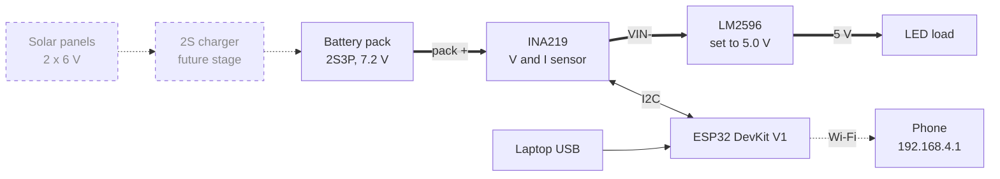
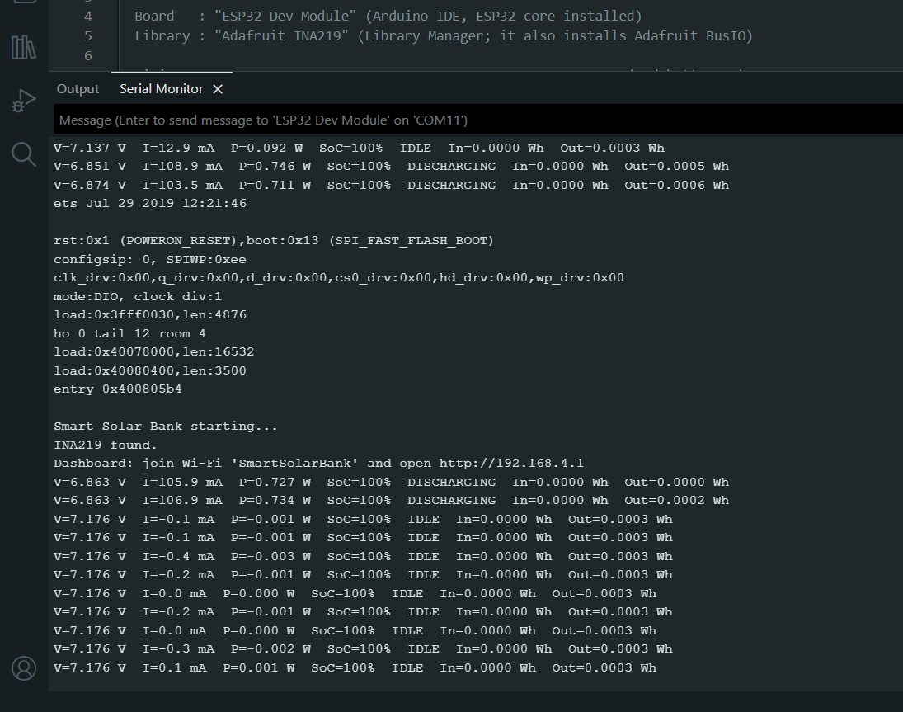

# Smart Solar Bank

An 18650 battery bank that measures its own voltage, current and energy, and shows them live on a phone through an ESP32 Wi-Fi dashboard.

   

| | |
| --- | --- |
| **Course** | [Subject / course name] |
| **Department / College** | [Department], [College] |
| **Guide** | [Guide name] |
| **Submitted** | 9 October 2026 |

| # | Team member | Roll number |
| :---: | --- | --- |
| 1 | | |
| 2 | | |
| 3 | | |
| 4 | | |

---

## What it does

An ordinary power bank shows four LEDs at best. This one reports what is actually happening inside it:

- **Live readings:** pack voltage, per-cell voltage, current, power
- **Charge estimate:** state of charge, corrected for voltage sag under load
- **Energy tracking:** watt-hours in and out, and time left at the present load
- **Direction:** CHARGING, DISCHARGING or IDLE, from the sign of the current
- **Fault alerts:** low battery, overcurrent (short circuit), missing ground, sensor disconnected
- **No app needed:** the ESP32 runs its own Wi-Fi network; any phone opens the page in a browser

## System overview



Battery current flows **pack → INA219 → LM2596 → load**. The INA219 reports to the ESP32 over I²C, and the ESP32 serves the dashboard over its own access point. Dashed boxes are the planned solar charging stage, which is not in this build ([why](#limitations)).


## Wiring at a glance

| From | To |
| --- | --- |
| Battery pack + | INA219 VIN+ |
| INA219 VIN− | LM2596 IN+ |
| Battery pack − | LM2596 IN−, INA219 GND, ESP32 GND |
| LM2596 OUT+ / OUT− (5.0 V) | Load + / − |
| INA219 VCC / GND / SDA / SCL | ESP32 3V3 / GND / D21 / D22 |

> [!WARNING]
> The INA219 goes **in series** on the positive line. Never connect battery − to VIN−: that is a dead short through the 0.1 Ω shunt.

The full bill of materials, wiring notes, build order and photos are in [docs/hardware.md](docs/hardware.md).

## Repository layout

```
smart-solar-bank/
├── README.md
├── firmware/
│   ├── smart_solar_bank/   main sketch: monitor + Wi-Fi dashboard
│   ├── i2c_scanner/        checks the INA219 is wired (expects 0x40)
│   └── blink_test/         checks the ESP32, cable and upload
└── docs/
    ├── hardware.md         components, wiring, build order, photos
    ├── how-it-works.md     measurement, formulas, alerts, settings
    ├── troubleshooting.md  every problem we hit and the fix
    └── images/
```

## Getting started

1. Install the **Arduino IDE** and the **ESP32 board package** (Boards Manager → "esp32" by Espressif).
2. Install the **Adafruit INA219** library (Library Manager; accept Adafruit BusIO when asked).
3. Select **Tools → Board → ESP32 Dev Module** and the ESP32's COM port.
4. Upload `firmware/blink_test`, then `firmware/i2c_scanner`, to check the board and the sensor.
5. Upload `firmware/smart_solar_bank`. If it stalls at `Connecting.....`, hold **BOOT** until the percentage starts.
6. Open the **Serial Monitor at 115200 baud**. You should see `INA219 found.`, then a reading every second.
7. On a phone, join Wi-Fi **SmartSolarBank** (password `solar1234`), turn off mobile data, and open **http://192.168.4.1**.

## Results

| Condition | Pack voltage | Current | Power | State |
| --- | --- | --- | --- | --- |
| No load | 7.176 V | ~0 mA | ~0 W | IDLE |
| LED load on | 6.863 V | 106.9 mA | 0.734 W | DISCHARGING |



- **Pack resistance:** the 0.313 V drop at 106.9 mA gives about 2.9 Ω. The firmware uses this to correct its charge estimate.
- **Charge at test time:** 7.176 V across two cells is 3.59 V per cell, about 18% charge.

How the numbers are computed is in [docs/how-it-works.md](docs/how-it-works.md).

## Problems we solved

We hit eleven faults during the build. The three that shaped the design:

1. **A dead short through the sensor.** The sensor read its `3200 mA` limit because the pack was wired across VIN+ and VIN− instead of in series.
2. **A 2S pack.** The pack read `7.16 V`, which is impossible for one cell. It turned out to be 2S, so the single-cell power bank board pushed its USB output above 5 V, and we switched to an LM2596.
3. **A missing common ground.** Without it, the voltage readings were fake (`0.88 V` and `3.0 V`).

The full list, with the symptom, cause and fix for each, is in [docs/troubleshooting.md](docs/troubleshooting.md).

## Limitations

| Limitation now | Next upgrade |
| --- | --- |
| Solar charging is not built: the available chargers are single-cell and the pack is 2S | A 2S (8.4 V) solar charge controller with a BMS, with the panels in series |
| The charge % comes from voltage, so it is an estimate | Coulomb counting from the measured current |
| About 2.9 Ω is lost in thin wire and solder-wire cell links | Nickel strip and thicker wire |
| The ESP32 runs from the laptop, not the pack | Power it from the LM2596 output for a standalone unit |

## Safety

- Use only rechargeable Li-ion cells. Primary lithium cells such as the Saft LS14500 must never be charged.
- Never charge a 2S pack with a single-cell (1S) charger.
- Connect battery + last and watch the Serial Monitor. If it shows `3200 mA`, or anything gets warm, disconnect immediately.
