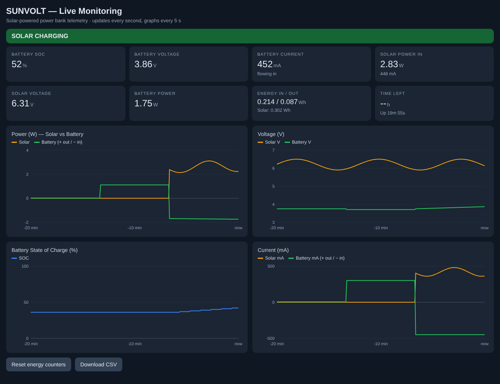
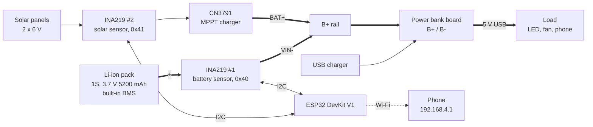

# Smart Solar Bank

A solar-charged 18650 power bank that measures its own voltage, current, power and energy and shows them as live graphs on a phone. The ESP32 runs the **SUNVOLT** dashboard over its own Wi-Fi network, so no internet connection or app is needed.

   

A side project by **Hardik Rawat**, **Shivraj Morde** and **Ismail Mohammed**.


<sub>Dashboard preview rendered with simulated values. On the device it shows live readings.</sub>

---

## What it does

- **Live tiles:** battery charge %, voltage, current, power, solar voltage and solar power, energy in and out, and time left.
- **Live graphs:** power, voltage, state of charge and current, with solar and battery plotted together on the power, voltage and current graphs. The graphs keep the last 30 minutes and fill in as soon as the page opens.
- **Direction:** CHARGING, SOLAR CHARGING, DISCHARGING or IDLE, worked out from the sign of the battery current.
- **Two ways to charge:** solar through a CN3791 MPPT charger, or USB through the power bank board's input.
- **Fault alerts:** low battery, overcurrent (short circuit), missing ground, disconnected sensor.
- **Data export:** a Download CSV button saves the full history for analysis.

## Status

| Part | State |
| --- | --- |
| Battery monitoring (INA219 #1): voltage, current, charge %, Wh | ✅ Verified on hardware |
| USB charging and 5 V output through the power bank board | ✅ Wired; standby current measured through the sensor |
| SUNVOLT dashboard with live graphs (`firmware/sunvolt`) | 🟡 Compiles; verified in a browser with simulated data |
| Solar charging through the CN3791 | 🟡 Wiring designed, not yet tested |
| Solar measurement (INA219 #2 at 0x41) | 🟡 Supported in firmware, sensor not yet fitted |
| Charging a phone from the bank | 🔴 Drops out under a phone's fast-charge load ([why](docs/troubleshooting.md#v2--1s-pack-and-power-bank-board)) |

## System overview



All battery current, in or out, flows through INA219 #1. That one sensor sees solar charging, USB charging and discharging, and the sign of its current gives the direction. INA219 #2, which is optional, measures what the panels deliver to the charger.

## Wiring at a glance

| From | To |
| --- | --- |
| Battery red (+) | INA219 #1 **VIN+** |
| INA219 #1 **VIN−** | Power bank **B+** and CN3791 **BAT+** |
| Battery black (−) | Power bank **B−**, CN3791 **BAT−**, INA219 #1 **GND** |
| Solar panel (+) | INA219 #2 **VIN+** (optional sensor; without it, panel + goes straight to CN3791 IN+) |
| INA219 #2 **VIN−** | CN3791 **IN+** |
| Solar panel (−) | CN3791 **IN−** |
| Both INA219s: VCC / GND / SDA / SCL | ESP32 3V3 / GND / D21 / D22 (in parallel) |

> [!WARNING]
> Each INA219 goes **in series** on a positive line. Never connect battery − to VIN−: that is a dead short through the 0.1 Ω shunt.

The parts list, full wiring, build order and photos are in [docs/hardware.md](docs/hardware.md).

## Repository layout

```
smart-solar-bank/
├── README.md
├── firmware/
│   ├── sunvolt/              main sketch: monitoring + SUNVOLT graphs dashboard
│   ├── i2c_scanner/          checks sensor wiring (0x40, and 0x41 if fitted)
│   ├── blink_test/           checks the ESP32, cable and upload
│   └── legacy_2s_lm2596/     v1 sketch for the earlier 2S pack + LM2596 build
└── docs/
    ├── hardware.md           parts, wiring, build order, photos
    ├── how-it-works.md       measurement, formulas, alerts, dashboard, settings
    ├── troubleshooting.md    every problem we hit and the fix
    └── images/
```

## Getting started

1. Install the **Arduino IDE** and the **ESP32 board package** (Boards Manager → "esp32" by Espressif).
2. Install the **Adafruit INA219** library from Library Manager, and accept Adafruit BusIO when asked.
3. Select **Tools → Board → ESP32 Dev Module** and the ESP32's COM port.
4. Upload `firmware/blink_test` to check the board, then `firmware/i2c_scanner` to check the sensors.
5. Upload `firmware/sunvolt`. If it stalls at `Connecting.....`, hold **BOOT** until the upload percentage starts.
6. Open the **Serial Monitor at 115200 baud**. You should see `Battery INA219 (0x40) found.`
7. On a phone, join Wi-Fi **SmartSolarBank** (password `solar1234`), turn off mobile data, and open **http://192.168.4.1**.

## Results

**v2: 1S 5200 mAh pack with the power bank board** (measured)

| Condition | Voltage | Current | Charge | State |
| --- | --- | --- | --- | --- |
| At rest, power bank board idle | 3.71 V | 4–8 mA (the board's own standby draw) | 36–37% | IDLE |

**v1: earlier 2S3P pack with the LM2596** (measured)

| Condition | Voltage | Current | Power | State |
| --- | --- | --- | --- | --- |
| No load | 7.176 V | ~0 mA | ~0 W | IDLE |
| LED load on | 6.863 V | 106.9 mA | 0.734 W | DISCHARGING |

How the numbers are calculated is explained in [docs/how-it-works.md](docs/how-it-works.md).

## Project history

| Version | Battery | 5 V output | Charging | Why it changed |
| --- | --- | --- | --- | --- |
| v1 | 6 × 18650 in 2S3P (7.2 V) | LM2596 buck | None (all our chargers were 1S) | No 2S charger on hand, and the pack ran down |
| v2 | 1S 3.7 V 5200 mAh with built-in BMS | Power bank board (boost) | USB, plus solar through the CN3791 | Current build |

## Problems we solved

We hit fourteen faults across the two builds. The ones that shaped the design:

1. **A dead short through the sensor.** The sensor read its 3200 mA limit because the pack was wired across VIN+ and VIN− instead of in series.
2. **A 2S pack fed to single-cell boards.** It pushed the power bank's USB output above 5 V. That is why v1 used an LM2596, and why v2 moved to a single-cell pack.
3. **A missing common ground**, which produced fake 0.9 V and 3.0 V readings.
4. **Firmware still set for 2S on a 1S pack.** It halved the cell voltage and raised a false LOW BATTERY alert.

The full list is in [docs/troubleshooting.md](docs/troubleshooting.md).

## Limitations and next steps

| Limitation now | Next step |
| --- | --- |
| A phone on fast charge drops out | Short, thick wires on the battery path; a 0.05 Ω shunt or an INA226 for higher current |
| The charge % comes from voltage, so it is an estimate | Coulomb counting from the measured current |
| Solar stage not yet tested | Fit the CN3791 and INA219 #2, then log a sunny day to CSV |
| The ESP32 runs from the laptop | Power it from the bank's second USB port for a standalone unit |

## Safety

- Use only rechargeable Li-ion cells. Primary lithium cells such as the Saft LS14500 must never be charged.
- Match the charger to the pack. A 1S charger is for a 1S pack only.
- Connect battery + last and watch the Serial Monitor. If it shows `3200 mA`, or anything gets warm, disconnect immediately.
- Don't recharge any cell that has been run down below about 2.5 V.
