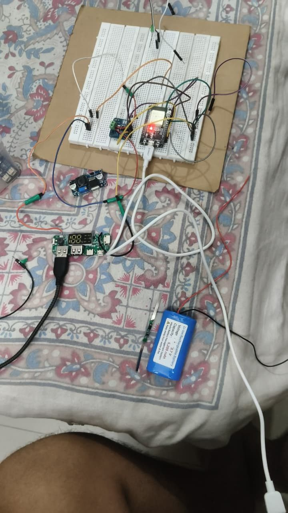
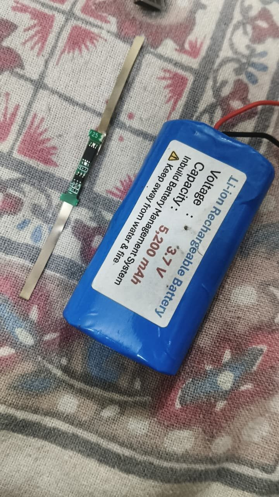
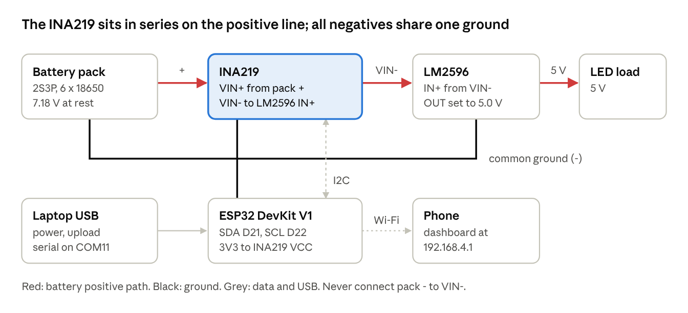

# Hardware

The current build (v2) is a single-cell 18650 pack feeding a power bank board. A CN3791 charges the pack from solar panels, and one INA219 on the battery line measures everything going in and out. A second INA219 for the solar side is optional. The earlier 2S + LM2596 build (v1) is kept at the end for reference.

## Bill of materials (v2)

| Component | Model / rating | Qty | Role |
| --- | --- | :---: | --- |
| ESP32 DevKit V1 | ESP-WROOM-32, 3.3 V logic, Wi-Fi | 1 | Reads the sensors, computes, hosts the SUNVOLT dashboard |
| INA219 module #1 | HW-831B, 0.1 Ω shunt, I²C address 0x40 | 1 | Battery voltage and current, both directions |
| INA219 module #2 *(optional)* | Same board, A0 pads bridged → address 0x41 | 1 | Solar panel voltage, current, power |
| Li-ion battery | 1S, 3.7 V, 5200 mAh, built-in BMS | 1 | Energy storage |
| Power bank board | 1S boost, 5 V USB-A out, micro-USB/Type-C in, display | 1 | 5 V output and USB charging |
| CN3791 solar charger | 1S MPPT, version matched to the panels (6 V or 12 V) | 1 | Charges the pack from the panels |
| Solar panels | 6 V | 2 | Solar input |
| Load | 5 V USB LED or fan | 1 | Demonstration load |
| Breadboard, jumpers, multimeter, soldering iron | — | — | Assembly and testing |

**Not used in v2:** the LM2596 (it can't step 3.7 V up to 5 V), the MT3608 (the power bank board already boosts), the loose BMS strip (the pack has one built in), the old 2S pack, and the Saft LS14500 cells (non-rechargeable).

## Wiring (v2)

### Sensors to ESP32

| # | From | To |
| :---: | --- | --- |
| 1 | INA219 #1 VCC | ESP32 3V3 |
| 2 | INA219 #1 GND | ESP32 GND |
| 3 | INA219 #1 SDA | ESP32 D21 |
| 4 | INA219 #1 SCL | ESP32 D22 |
| 5 | ESP32 micro-USB | Laptop USB (upload, Serial Monitor) |

### Battery side

| # | From | To |
| :---: | --- | --- |
| 6 | Battery black (−) | Power bank board **B−** |
| 7 | Battery black (−) | INA219 #1 **GND** pin |
| 8 | INA219 #1 **VIN−** (top screw) | Power bank board **B+** |
| 9 | Battery red (+) | INA219 #1 **VIN+** (bottom screw), **connected last** |

### Solar side

| # | From | To |
| :---: | --- | --- |
| 10 | CN3791 **BAT+** | Same point as power bank B+ (INA219 #1 VIN−) |
| 11 | CN3791 **BAT−** | Same point as battery black / power bank B− |
| 12 | Panels (+) | CN3791 **IN+**, or INA219 #2 **VIN+** when the solar sensor is fitted |
| 13 | INA219 #2 **VIN−** *(sensor fitted)* | CN3791 **IN+** |
| 14 | Panels (−) | CN3791 **IN−** |
| 15 | INA219 #2 VCC / GND / SDA / SCL *(sensor fitted)* | ESP32 3V3 / GND / D21 / D22, in parallel with sensor #1 |

**Panel wiring depends on the CN3791 version.** For the 6 V version, connect the two panels in parallel (+ to +, − to −). For the 12 V version, connect them in series.

> [!WARNING]
> Battery − connects only to B−, CN3791 BAT− and INA219 GND. It never goes to either green screw terminal.

> [!NOTE]
> Many CN3791 modules have no reverse-polarity protection. Check BAT+ and BAT− with a multimeter before connecting.

### Power bank board ports

| Port | Use |
| --- | --- |
| USB-A output | The load (LED, fan, or a phone on slow charge) |
| Micro-USB / Type-C input | A phone charger, for USB charging and indoor demos |

## Build order

Test each step on the Serial Monitor before adding the next.

1. **ESP32 alone.** Upload [`blink_test`](../firmware/blink_test). The LED should blink and "ESP32 is alive!" should print.
2. **Sensor #1.** Wire 1–4, then upload [`i2c_scanner`](../firmware/i2c_scanner). It should print `Found 0x40`.
3. **Check the battery.** Measure it with a multimeter. It should read 3.0–4.2 V.
4. **Battery side.** Connect wires 6, 7 and 8, then wire 9 last. Upload [`sunvolt`](../firmware/sunvolt). It should show about 3.7 V, a few mA and IDLE.
5. **Load test.** Plug the LED or fan into USB-A. It should show DISCHARGING with a positive current.
6. **USB charge test.** Plug a charger into the board's input. It should show CHARGING with a negative current.
7. **Solar.** Connect wires 10, 11, 12 and 14, then put the panels in the sun. It should show SOLAR CHARGING once sensor #2 is fitted, or CHARGING without it.
8. **Solar sensor (optional).** Bridge the A0 pads on sensor #2 and connect wires 13 and 15. The scanner should then print `Found 0x40` and `Found 0x41`.

## Photos

| | |
| :---: | :---: |
|  |  |
| The v2 setup on the bench | 1S 3.7 V 5200 mAh pack with built-in BMS |
|  |  |
| INA219 (HW-831B) current sensor | ESP32 DevKit V1 and the power bank board |

---

## v1 reference: 2S3P pack with LM2596

The first build used six ICR18650 cells in 2S3P (7.2 V, 7500 mAh). An LM2596 set to 5.0 V stepped the pack down for the load. It worked as a monitor, but none of our chargers could charge a 2S pack. Its sketch is in [`firmware/legacy_2s_lm2596`](../firmware/legacy_2s_lm2596).

| | |
| :---: | :---: |
|  |  |
| The six-cell 2S3P pack | v1 sensor and ESP32 on the breadboard |
|  |  |
| LM2596 buck (used in v1), MT3608 and RF module (unused) | First set of cells, panels and a single-cell solar charger |
