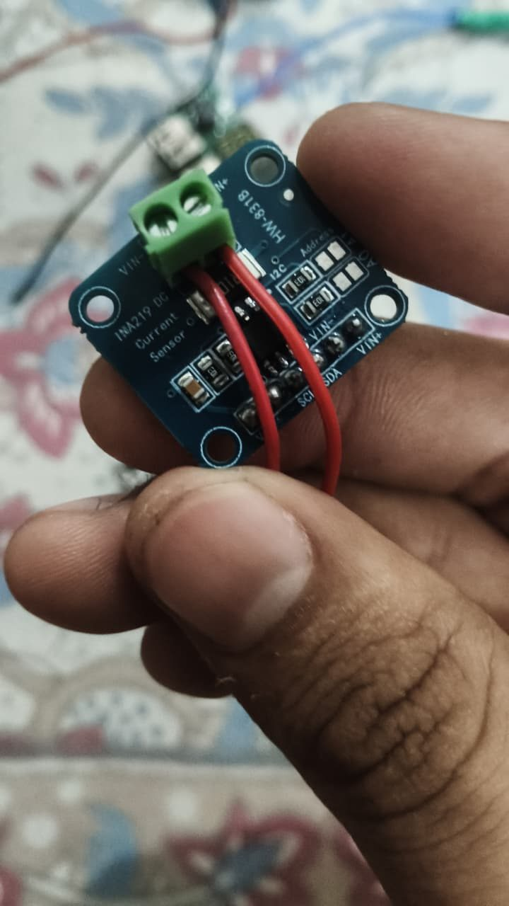
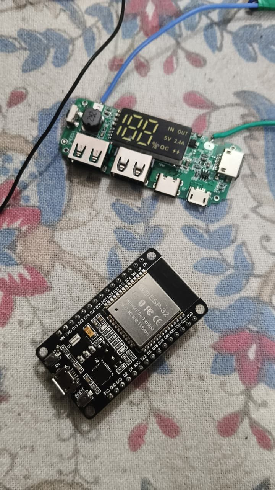
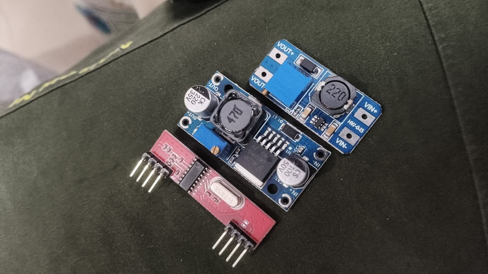
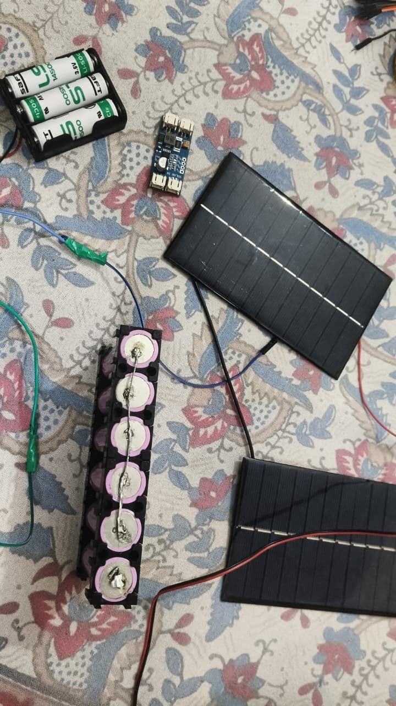
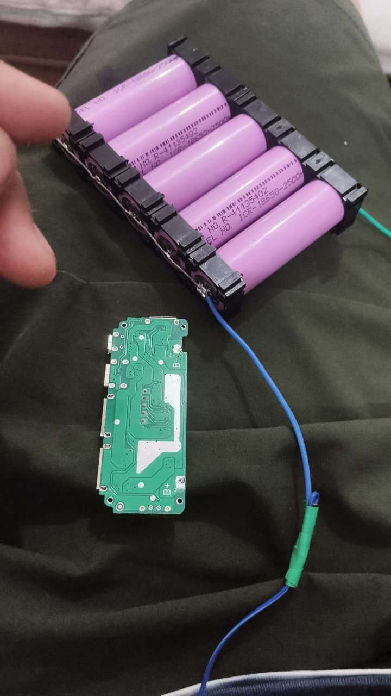
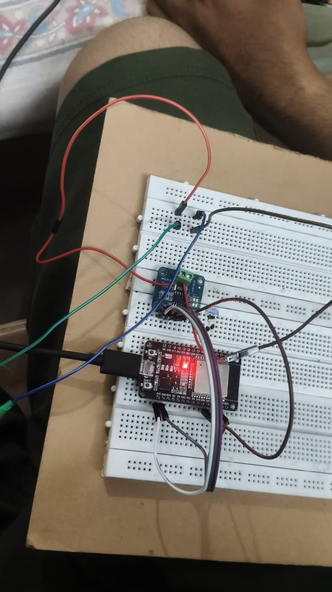

# Hardware

The final circuit uses four parts: the ESP32, the INA219, the six-cell 18650 pack and the LM2596. The solar panels and the single-cell charger boards were tested but are not in the final build, because the pack turned out to be 2S (two cells in series) and those boards only handle one cell.

## Bill of materials

| Component | Model / rating | Qty | Role | In final build |
| --- | --- | :---: | --- | :---: |
| ESP32 DevKit V1 | ESP-WROOM-32, 3.3 V logic, Wi-Fi | 1 | Reads the sensor, computes, hosts the dashboard | Yes |
| INA219 module | HW-831B, 0.1 Ω shunt, I²C address 0x40 | 1 | Measures pack voltage and current | Yes |
| Li-ion cells | ICR18650, 2500 mAh, 3.7 V nominal | 6 | Storage, wired 2S3P (about 7.4 V, 7500 mAh) | Yes |
| 18650 holder | 6-slot, soldered links | 1 | Holds and connects the cells | Yes |
| LM2596 buck converter | 3–40 V in, output set to 5.0 V | 1 | Steps the 7 V pack down to 5 V | Yes |
| LED load | 5 V | 1 | Demonstration load | Yes |
| Solar panels | 6 V | 2 | Input for the planned charging stage | No |
| Solar charger module | Single cell (1S) | 1 | Tested; cannot charge a 2S pack | No |
| Power bank board | Single cell (1S), 5 V USB out, display | 1 | Tested; unsafe with a 2S pack | No |
| Saft LS14500 cells | 3.6 V primary lithium, **non-rechargeable** | 3 | Excluded: charging them can cause fire | No |
| Breadboard, jumpers, multimeter, soldering iron | — | — | Assembly and testing | — |

## Wiring

| From | To | Purpose |
| --- | --- | --- |
| Battery pack + | INA219 **VIN+** (green screw terminal) | Battery current enters the sensor |
| INA219 **VIN−** | LM2596 IN+ | Measured current continues to the load |
| Battery pack − | LM2596 IN−, INA219 GND, ESP32 GND | One common ground |
| LM2596 OUT+ / OUT− | LED load + / − | Regulated 5.0 V |
| INA219 VCC | ESP32 3V3 | Sensor supply |
| INA219 SDA | ESP32 D21 | I²C data |
| INA219 SCL | ESP32 D22 | I²C clock |
| ESP32 micro-USB | Laptop USB | Power, upload, Serial Monitor |

> [!WARNING]
> Never connect battery − to VIN−. That puts the whole pack across the 0.1 Ω shunt, a dead short. The sensor then reads its 3200 mA limit and the ESP32 resets.

> [!NOTE]
> Read the VIN+ and VIN− labels printed on your own INA219 board before connecting. On our HW-831B the screw nearer the "VIN+" label is VIN+.

## Build order

Test each step on the Serial Monitor before adding the next.

1. **ESP32 alone.** Upload [`blink_test`](../firmware/blink_test). The LED blinks and "ESP32 is alive!" prints.
2. **Add the INA219.** Wire VCC, GND, SDA and SCL only, then upload [`i2c_scanner`](../firmware/i2c_scanner). "Found 0x40" means it is wired correctly.
3. **Check the pack.** Measure across its two wires with a multimeter. 3.0–4.2 V means 1S; 6.0–8.4 V means 2S (ours read 7.18 V).
4. **Set the LM2596.** With nothing on its output, turn the brass screw until OUT+ to OUT− reads 5.0 V.
5. **Wire the power path.** Pack − to ground first, then VIN− to LM2596 IN+, and pack + to VIN+ last, with the Serial Monitor open.
6. **Upload the main sketch.** Upload [`smart_solar_bank`](../firmware/smart_solar_bank) and open the dashboard on a phone.

## Photos

| | |
| :---: | :---: |
|  |  |
| INA219 (HW-831B) current sensor | ESP32 DevKit V1 and the power bank board |
|  |  |
| LM2596 buck (used), MT3608 boost and RF module (not used) | 18650 pack, solar panels and solar charger |
|  |  |
| The six-cell 2S3P pack | INA219 and ESP32 on the breadboard |
