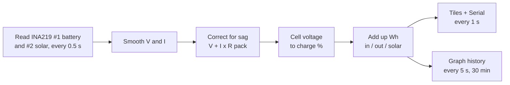

# How it works

The ESP32 reads the INA219 sensors every 0.5 s and smooths the readings. It corrects the battery voltage for sag under load, then estimates the charge. Every second it sends the numbers to the Serial Monitor and the dashboard tiles, and every 5 s it adds a point to the graphs.

## 1. Measure

Each INA219 measures the small voltage across its 0.1 Ω shunt resistor and the voltage on its VIN− side.

$$I = \frac{V_{shunt}}{0.1\ \Omega} \qquad V = V_{bus} + V_{shunt} \qquad P = V \times I$$

On the battery sensor the sign of the current gives the direction. Positive means discharging, negative means charging, and anything within ±20 mA counts as idle. Every source of charge passes through this one sensor: the USB input on the power bank board and the CN3791 solar charger both feed the battery through it.

The optional solar sensor sits between the panels and the CN3791. Its current is never negative, because a charger never sends current back into the panel.

## 2. Correct for voltage sag

Under load, the battery's terminal voltage drops across the pack's internal resistance and the wiring. Without a correction, the charge estimate would jump every time a load switched on or off.

$$V_{rest} = V + I \times R_{pack}$$

`PACK_RESISTANCE_OHM` is 0.15 Ω for the 1S pack, which is an estimate. Measure the real value as (V idle − V loaded) ÷ load current in amps. On the v1 2S pack it measured 2.9 Ω: 7.176 V at rest and 6.863 V at 106.9 mA.

## 3. Estimate charge

The rest voltage per cell is looked up on a Li-ion curve, with straight-line interpolation between the table points.

| Cell voltage | 3.30 | 3.50 | 3.60 | 3.70 | 3.80 | 3.90 | 4.00 | 4.10 | 4.20 |
| --- | --- | --- | --- | --- | --- | --- | --- | --- | --- |
| Charge % | 0 | 10 | 20 | 35 | 50 | 65 | 80 | 90 | 100 |

$$E_{Wh} = \sum V \times I \times \Delta t \qquad t_{left} = \frac{5200\ \text{mAh} \times SoC}{I}$$

## 4. States and alerts

| State or alert | Triggered when |
| --- | --- |
| SOLAR CHARGING | Battery current below −20 mA and solar current above 20 mA |
| CHARGING | Battery current below −20 mA (USB charging, or solar with no solar sensor) |
| DISCHARGING / IDLE | Battery current above +20 mA / within ±20 mA |
| LOW BATTERY | Rest voltage below 3.30 V per cell while not charging |
| OVERCURRENT – DISCONNECT | Current at the INA219's ~3200 mA limit (likely a short) |
| NO BATTERY | Battery voltage below 1.5 V (missing common ground, or battery not on VIN+) |
| SENSOR NOT FOUND | INA219 #1 not answering at 0x40; the firmware retries every 3 s |

## 5. The SUNVOLT dashboard

The page is stored inside the firmware and draws its graphs itself on HTML canvas. It downloads nothing, so it works on the ESP32's own Wi-Fi with no internet connection.

| Graph | Lines |
| --- | --- |
| Power (W) | Solar W; battery W (+ out / − in) |
| Voltage (V) | Solar V; battery V |
| State of charge (%) | SOC, fixed 0–100 axis |
| Current (mA) | Solar mA; battery mA (+ out / − in) |

The ESP32 stores 360 points, one every 5 s, which covers 30 minutes. When the page opens it fetches the whole history at once. After that it fetches only points newer than the last one it has.

| Path | Returns |
| --- | --- |
| `/` | The dashboard page |
| `/data` | Live readings as JSON (refreshed every 1 s by the page) |
| `/history?since=<s>` | Graph points newer than `<s>` seconds |
| `/history.csv` | The full stored history as a CSV download |
| `/reset` | Clears the energy counters |

## Firmware settings

These settings are at the top of [`sunvolt.ino`](../firmware/sunvolt/sunvolt.ino).

| Setting | Value | Change it when |
| --- | --- | --- |
| `CELLS_IN_SERIES` | 1 | Using a multi-cell pack |
| `PACK_CAPACITY_MAH` | 5200 | Using a different battery |
| `PACK_RESISTANCE_OHM` | 0.15 | You have measured the real value (section 2) |
| `CURRENT_SIGN` | 1.0 | CHARGING and DISCHARGING look swapped (set −1.0) |
| `SOLAR_SIGN` | 1.0 | Solar current reads 0 in full sun (set −1.0) |
| `HIST_MS` / `HIST_N` | 5000 / 360 | You want longer or finer graph history |
| `AP_SSID` / `AP_PASS` | SmartSolarBank / solar1234 | You want a different Wi-Fi name or password |
