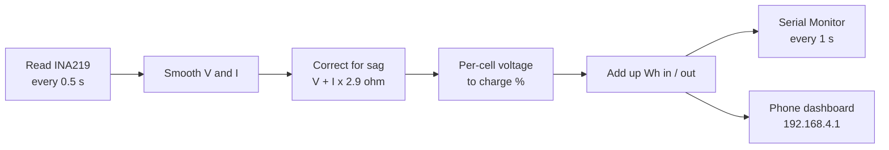

# How it works

The ESP32 reads the INA219 twice a second, corrects for voltage sag, estimates the charge, and reports once a second to the Serial Monitor and the phone dashboard.

## 1. Measure

The INA219 measures the small voltage across its 0.1 Ω shunt resistor and the voltage on VIN−.

$$I = \frac{V_{shunt}}{0.1\ \Omega} \qquad V_{pack} = V_{bus} + V_{shunt} \qquad P = V_{pack} \times I$$

The sign of the current gives its direction. Positive means discharging, negative means charging, and anything within ±20 mA counts as idle.

## 2. Correct for voltage sag

Under load the pack voltage drops across its internal and wiring resistance. Without a correction, the charge estimate would jump down every time the load switched on. We measured the resistance from our own readings: 7.176 V at rest and 6.863 V at 106.9 mA.

$$R = \frac{7.176 - 6.863}{0.1069} \approx 2.9\ \Omega \qquad V_{rest} = V_{pack} + I \times R$$

## 3. Estimate charge

The rest voltage is divided by 2, because two cells are in series, and looked up on a Li-ion curve. Values between table points are interpolated in a straight line.

| Per-cell voltage | 3.30 | 3.50 | 3.60 | 3.70 | 3.80 | 3.90 | 4.00 | 4.10 | 4.20 |
| --- | --- | --- | --- | --- | --- | --- | --- | --- | --- |
| Charge % | 0 | 10 | 20 | 35 | 50 | 65 | 80 | 90 | 100 |

Energy is added up every sample, and time left divides the remaining capacity by the present current.

$$E_{Wh} = \sum V \times I \times \Delta t \qquad t_{left} = \frac{7500\ \text{mAh} \times SoC}{I}$$

## 4. Report and warn

| State or alert | Triggered when |
| --- | --- |
| CHARGING / DISCHARGING / IDLE | Current below −20 mA / above +20 mA / in between |
| LOW BATTERY | Rest voltage below 3.30 V per cell while not charging |
| OVERCURRENT – DISCONNECT | Current at the INA219's ~3200 mA limit (likely a short) |
| NO BATTERY | Pack voltage below 1.5 V (no common ground, or pack not on VIN+) |
| LM2596 headroom alert | Discharging with the pack below 6.5 V |
| SENSOR NOT FOUND | INA219 not answering at 0x40; retried every 3 s |

## Firmware settings

These sit at the top of [`smart_solar_bank.ino`](../firmware/smart_solar_bank/smart_solar_bank.ino).

| Setting | Value | Change it when |
| --- | --- | --- |
| `CELLS_IN_SERIES` | 2 | Your pack is 1S (set 1) |
| `PACK_CAPACITY_MAH` | 7500 | Different cells or a different parallel count |
| `PACK_RESISTANCE_OHM` | 2.9 | You rewire with thicker wire or nickel strip (re-measure) |
| `CURRENT_SIGN` | 1.0 | CHARGING and DISCHARGING appear swapped (set −1.0) |
| `AP_SSID` / `AP_PASS` | SmartSolarBank / solar1234 | You want a different Wi-Fi name or password |

## Dashboard endpoints

| Path | Returns |
| --- | --- |
| `/` | The dashboard page |
| `/data` | Live readings as JSON |
| `/reset` | Clears the energy counters |
