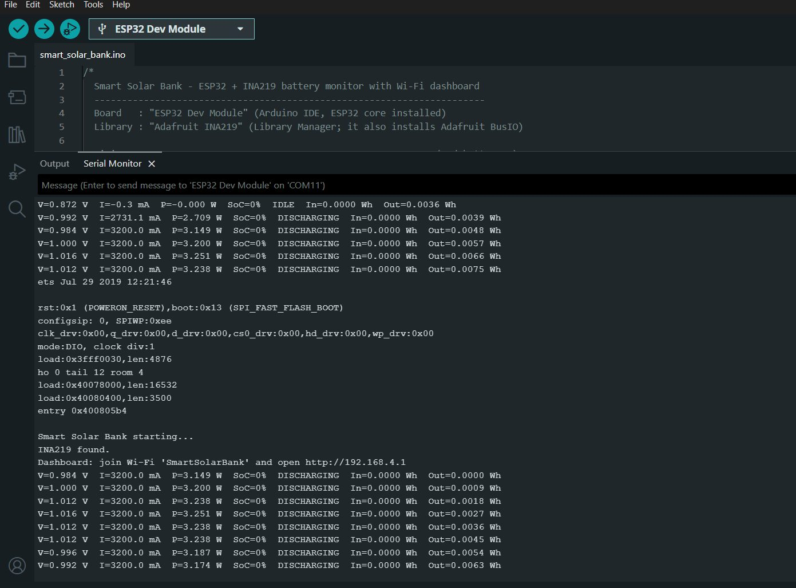

# Problems we faced and how we solved them

These are the faults we hit across both builds, in the order we met them. The short circuit through the shunt (3), finding out the old pack was 2S (6), and moving to a single-cell pack (v2) shaped the final design.

## v1 — 2S pack and LM2596

| # | What we saw | Cause | Fix |
| :---: | --- | --- | --- |
| 1 | Upload failed: `A serial exception error occurred: Write timeout` | COM4 was not the ESP32's port | Selected COM11, the port that appears when the board is plugged in |
| 2 | I²C scan printed `--- scan done ---` with nothing found | INA219 jumper wires not making contact | Re-seated the four wires; the scan found `0x40` |
| 3 | Current stuck at `3200.0 mA` and the ESP32 reset | Pack + and − on VIN+ and VIN−: a dead short through the 0.1 Ω shunt | Disconnected at once; rewired the INA219 in series, pack − to ground only |
| 4 | The short came back after rewiring | Power wires sharing rows of the breadboard power rail | Moved battery wiring off the breadboard; twisted and taped the joints |
| 5 | Fake `0.88 V` and `3.0 V` readings with ~0 mA | No common ground between pack − and INA219 GND | Added the ground wire |
| 6 | Pack read `7.16 V`, above the 4.2 V single-cell maximum | Pack is 2S: two cells in series | Redesigned the power path for a 2S pack |
| 7 | Phone showed "charging" briefly, then stopped | 1S power bank board fed 7 V; its USB output rose above 5 V | Removed the board; used the LM2596 set to 5.0 V |
| 8 | LED glowed but the sensor read 0 mA | LM2596 wired straight to the pack, bypassing the INA219 | Pack + to VIN+, VIN− to LM2596 IN+ |
| 9 | Charge stuck at 100%, then near 0% under load | Code assumed one cell, and voltage sags under load | Per-cell voltage and the 2.9 Ω correction in the firmware |
| 10 | Non-rechargeable cells in the kit | Saft LS14500 primary lithium cells | Kept them out of the build |
| 11 | IDE pop-up: `Unable to find executable file ... .ino.elf` | The debug button was pressed before the compile had finished | Closed the pop-up; used the Upload (→) button |

## v2 — 1S pack and power bank board

| # | What we saw | Cause | Fix |
| :---: | --- | --- | --- |
| 12 | `LOW BATTERY`, `Cell=1.85 V`, 0% on a healthy pack reading 3.7 V | v1 firmware still assumed 2 cells and halved the voltage | Firmware set to `CELLS_IN_SERIES = 1`, 5200 mAh; readings became 3.71 V and 36–37% |
| 13 | LM2596 left in the circuit with the 3.7 V pack | A buck converter can only lower voltage; it cannot make 5 V from 3.7 V | Removed it; the power bank board's boost converter makes the 5 V |
| 14 | Phone showed "charging" for a moment, then stopped | Most likely voltage sag: 2–3 A through the 0.1 Ω shunt and thin jumpers drops the board's input below its cut-off | Demo with an LED or fan; next step is short, thick battery wiring or a lower-value shunt |

**Not a fault:** at rest the dashboard shows 4–8 mA and IDLE. That current is the power bank board's own standby draw. It shows up because the board's B+ is fed through the sensor, which also proves the wiring is correct. The firmware treats anything under ±20 mA as IDLE.

## The short circuit (problem 3)

`I=3200.0 mA` is the highest value the INA219 can report, not a real reading. With the pack connected across VIN+ and VIN−, about 7 V sat directly across the 0.1 Ω shunt. The fix is to put the sensor in series: current enters at VIN+ and leaves at VIN− for the load.

## Quick checks

| Serial Monitor shows | Check |
| --- | --- |
| `Battery INA219 (0x40) NOT found` | VCC to 3V3 (not VIN), GND, SDA to D21, SCL to D22; run `i2c_scanner` |
| `Solar INA219 (0x41) not fitted` | Normal without sensor #2; if fitted, check the A0 pads are bridged and the four wires |
| `LOW BATTERY` on a 3.7 V pack | `CELLS_IN_SERIES` is wrong for your pack |
| `V` about 0.9 V or 3.0 V, `I` about 0 mA | Pack − is not connected to INA219 GND |
| `I=3200.0 mA` | Disconnect pack + now; pack − is touching VIN− somewhere |
| Correct `V` but 0 mA with a load on | The load is not fed from VIN−; the sensor is bypassed |
| CHARGING and DISCHARGING swapped | Set `CURRENT_SIGN` to `-1.0` |
| Upload stuck at `Connecting.....` | Hold the BOOT button until the percentage starts |
| Phone joins Wi-Fi but the page won't load | Turn off mobile data, then open `192.168.4.1` |
